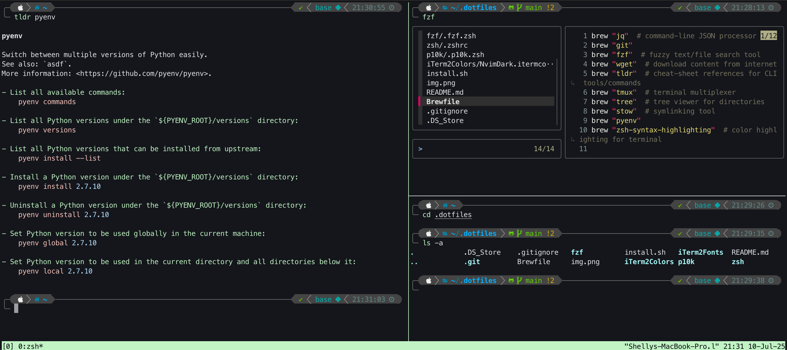

# .dotfiles

Personal dev environment for macOS 🪴

## Stuff Included

**Terminal**:


**Python**:


**System**:




## How It Works

Configuration dotfiles are stored and managed in a centralized repo to allow for easy synchronization of your preferred dev environment across multiple machines.

Gnu's [stow](https://www.gnu.org/software/stow/) tool creates symbolic links of the config files from this repo into your `~` home directory.

For example, the [`zsh/`](./zsh/) directory contains the [`.zshrc`](./zsh/.zshrc) config file. Running `stow zsh` is equivalent to:

```
ln -s ~/.dotfiles/zsh/.zshrc ~/.zshrc
```

Stow can symlink folders too - which grants greater flexiblity in managing not only your config files, but your installed packages as well.

## Usage

**New environment**: clone the repo to your `~` home directory and run `source install.sh`

-   **iTerm2 Font**: [`install.sh`](./install.sh) will add _MesloLGS NF_ to your Fonts library. To set this as iTerm2 font (which makes P10k icons work), go to `iTerm2 -> Settings -> Profiles -> Text -> Font` and select _MesloLGS NF_. If you use VSCode's terminal, set _MesloLGS NF_ as the font in VSCode: `Settings -> Terminal -> Integrated: Font Family`
-   **iTerm2 Colors**: Go to `iTerm2 -> Settings -> Profiles -> Colors -> Color Presets`. Select "Import" and upload the [`iTerm2Colors/NvimDark.itermcolors`](./iTerm2Colors/NvimDark.itermcolors) file from this repo. Click on the dropdown again and select NvimDark. More colors are available [here](https://iterm2colorschemes.com).


**Existing environment**: `git pull` any updates and the symlinks will auto-update

## Testing Changes

From my experience, the easiest way to test changes to these dotfiles is by creating a new user. Virtualization for macOS is difficult and largely unsupported due to Apple's Software Licensing Agreements. Cloud instances for macOS are much more costly than Linux/Windows for the same reason.

Creating a new user grants you a fresh `~` home directory to mess around in. XCode, Homebrew, and Homebrew packages are typically system-level. However, miniconda, Oh My Zsh, P10k, and [`.zshrc`](./zsh/.zshrc) related configs are installed at the user-level in this repo.

## Resources

_Dotfiles references & inspo_:

-   https://github.com/byteio/.dotfiles
-   https://leeked.medium.com/dotfiles-for-developers-part-1-8b599ba92f75
